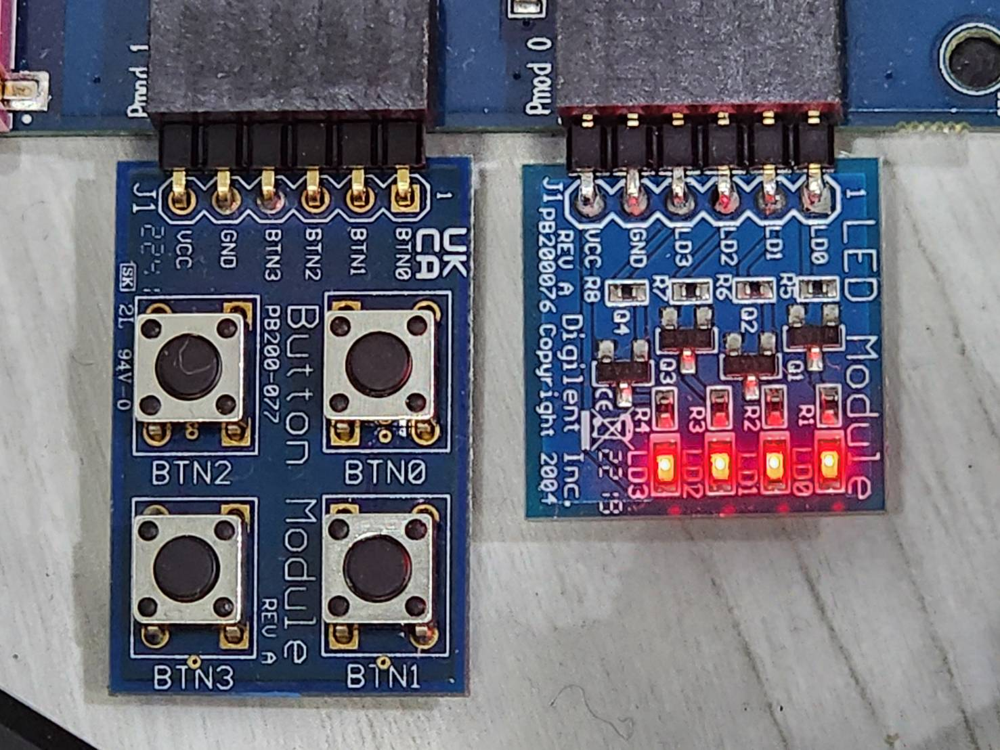

# Intro
**Pmod = Peripheral module**


不同於之前教學內容偏軟體，這個可控制硬體。

Tests and develop program to control the GPIO hardware pins of Renesas RZ/G2L under the Linux environment

**Module Board** (upper)

**Carrier Board** (bottom)

**P-Mode Interface**




Check if the hardware can be access properly first, then write those procedure as C/C++ programs. Finally, for the integration with our system, we'll write the code using Qt/QML.


Please reference the below document to understand how the use Linux Sysfs. In Linux, we usually control I/O pin through the read/write of some specific files. We also need to follow the command sequence.

Our first step is to use '**echo**' command to **write value** and use '**cat**' command to **show the content** of a file.  We will write all of the commands as a program after the command-line test. The below is the Renesas official document,

[RZ/G Verified Linux Package [5.10-CIP]](https://www.renesas.com/en/products/microcontrollers-microprocessors/rz-mpus/rzg-linux-platform/rzg-marketplace/verified-linux-package/rzg-verified-linux-package#Download)

Under the section of "Related Document", Click on the item:

```
For RZ/G2L Group
RZ/G2L,Five,V2L Group BSP Manual Set (RTK0EF0045Z9000AZJ-v3.0.6.zip) (ZIP)
```


### or

directly **download** by the below link **after login**:

[](https://www.renesas.com/en/document/mas/rzg2-group-bsp-manual-set?r=1597481)


Decompress the file " RTK0EF0045Z9006AZJ-v3.0.6.zip", find the below **GPIO document**,

`r01us0488ej0109-rz-g_GPIO_UME.pdf`

[R01US0405EJ0111_GPIO_UME_v1.11.pdf](https://prod-files-secure.s3.us-west-2.amazonaws.com/41f30fda-f209-4ad6-af17-1d205944b6dd/55b8565c-b0dc-4ef7-8fca-fad639b36486/R01US0405EJ0111_GPIO_UME_v1.11.pdf)

