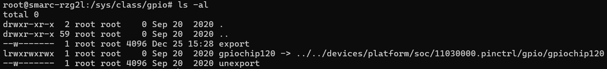
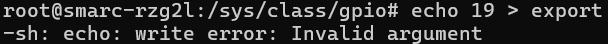

# Linux GPIO Driver
[sysfs](https://en.wikipedia.org/wiki/Sysfs)

**sysfs** is a **pseudo file system** provided by the Linux kernel that exports information about various kernel subsystems, hardware devices, and associated device drivers from the kernel's device model to user space through virtual files. In addition to providing information about various devices and kernel subsystems, exported virtual files are also used for their configuration.

# （Renesas_RZ/G2L）

In Linux, we usually use these 2 simple commands to access files

- READ content from a file:

`cat filename`

- WRITE content to a file

`echo xxx > filename`

### **Linux GPIO Sysfs Interface**

Please reference to the document first.

[www.kernel.org](https://www.kernel.org/doc/Documentation/gpio/sysfs.txt)

The important steps:

1. Ask kernel for the control privilege

**cd /sys/class/gpio**



for example, to get the control privilege of GPIO19

```
echo 19 > export  # write into port number（wrong example because the GPIO port number doesn't exist）
```



### Set read/write direction:

/sys/class/gpio/**gpioN**/  # after echo to export as above, it creates new folder called **gpioN** (gpioN means port numer of gpio)

Change direction:

```
echo "out" > direction
```