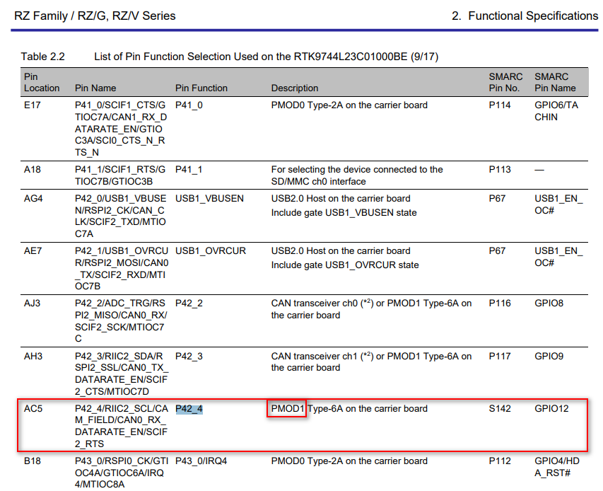

# Renesas GPIO Definition
http://140.112.12.82/docu-moil-renesas/assets/files/r01us0488ej0109-rz-g_GPIO_UME-d2505425b42fa90976cf6547fe538323.pdf

RZ/G2L can support up to 123 general-purpose I/O pins from 49 ports ( **Page 8. Table** )


### **Formula** :

**Page 14.** in the above document:


For example: P42_4

### **Port ID of `P42_4` = 42 * 8 + 4 + 120 = 460**

It is used to export a GPIO pin in userspace.

Table 4-1 Example GPIO device nodes of RZ/G2L ( Page 16. in the above document)


### **Test** :

```
cd /sys/class/gpio
echo 460 > export
ls -al
```

A new folder “**P42_4**” will be created.


Check the description about P42_4 in the above document,


Continue the below testing:

```
echo 1 > value ( error )
cat direction
in
echo “out” > direction
cat direction
out
echo 1 > value
cat value
echo 0 > value
cat value
```


### **Carrier Board**

Now we want to **find out the pin** corresponding. Check the document of the carrier board.

Check the item

```
"Documentation"/ "Manual - Development Tools"/
"RZ SMARC Series Carrier Board User's Manual:Hardware"
```

In the below Renesas document,

[RZ/G2L-EVKIT - Evaluation Board Kit for RZ/G2L MPU](https://www.renesas.com/en/products/microcontrollers-microprocessors/rz-mpus/rzg2l-evkit-evaluation-board-kit-rzg2l-mpu#documents)





Find out where is the hardware pin for P42_4?

[RZ SMARC Series Carrier Board User’s Manual: Hardware](http://140.112.12.82/docu-moil-renesas/assets/files/r01uh0966ej0122-rz-RTK97X4XXXB00000BE-9bfd716ef96e14f68272c6a65f662578.pdf)

Check Page 34, Figure 2.16 Block Diagram of PMOD1 I/F


### The third one in the bottom row:

