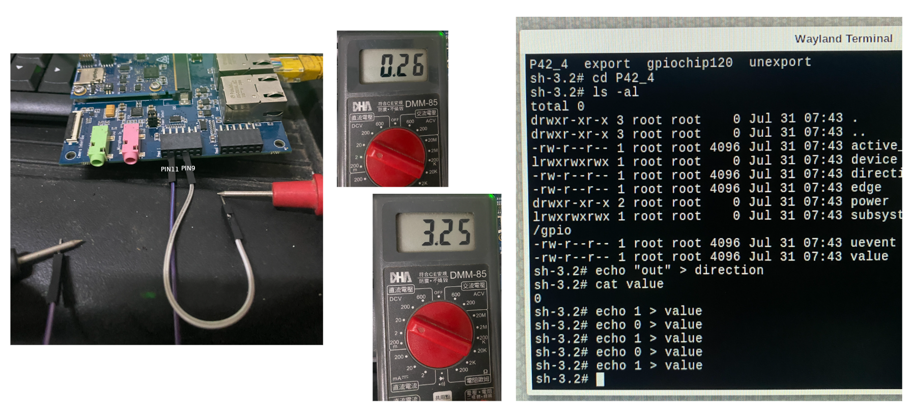
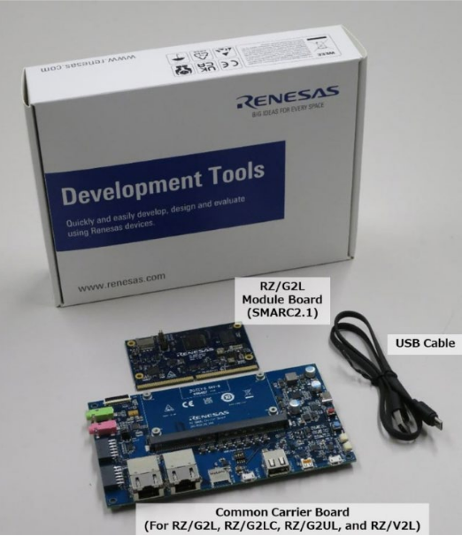
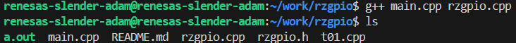
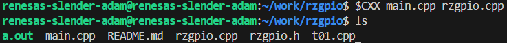

# Control GPIO Hardware from C/ C++ Program
Access GPIO pins through the **file system** using the **sysfs interface**.  

[How to Control GPIO Hardware from C or C++](https://www.ics.com/blog/how-control-gpio-hardware-c-or-c)

Example code :

```cpp
int fd = open("/sys/class/gpio/export", O_WRONLY);  # Write Only
   if (write(fd, "460", 2) != 2) {
       perror("Error writing to /sys/class/gpio/export");
       exit(1);
    }
 close(fd);
```

We can test GPIO P42_4 at PMOD1 #9 Pin with a multimeter.

:::[Caution] Be careful not to burn your board! :::



### **Reference program:**

Check out the example code at Github Repo. Follow the instructions in the README.md to build the project, then copy the output executable to RZ/G2L for testing.

https://github.com/yourskc/rzgpio.git

**RsGPIO : Renesas RZ/G2L GPIO control**

GPIO Test C++ Program for Renesas RZ/G2L



**1. Environment**

For cross compilation from x86_64 to aarch64, we need install poky toolchain.

Please reference to Renesas Linux Start-up Guide to build toolchain using Yocto project, then install them on your system. After the installation, use the below commands,

```
cd /opt/poky/3.1.26
unset LD_LIBRARY_PATH
. environment-setup-aarch64-poky-linux
```

Clone the repository,

```
cd <workdir>
git clone https://github.com/yourskc/rzgpio.git
cd rzgpio
```

**2. Compile**

On **x86_64(Intel 64 bits cpu)**, we can use g++ to compile for debugging

```
g++ main.cpp rzgpio.cpp
```



Finally, we'll compile a **aarch64 version** with the **cross compiler**

```
$CXX main.cpp rzgpio.cpp
```



**3. Transfer and run the executable on RZ/G2L**

```
mv a.out rzgpio
scp rzgpio root@192.168.0.216:/home/root
```

or, from RZ/G2L

```
scp skc@192.168.0.105:/home/skc/rzgpio .

./rzgpio
```