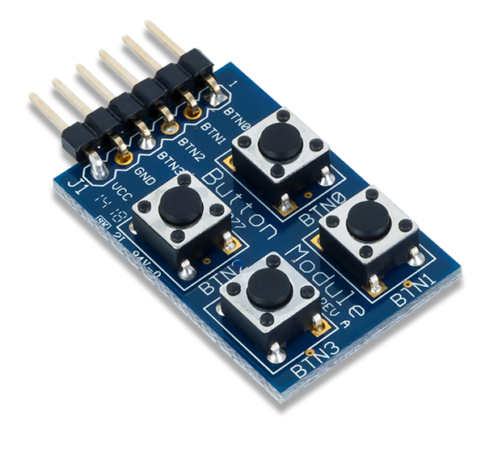
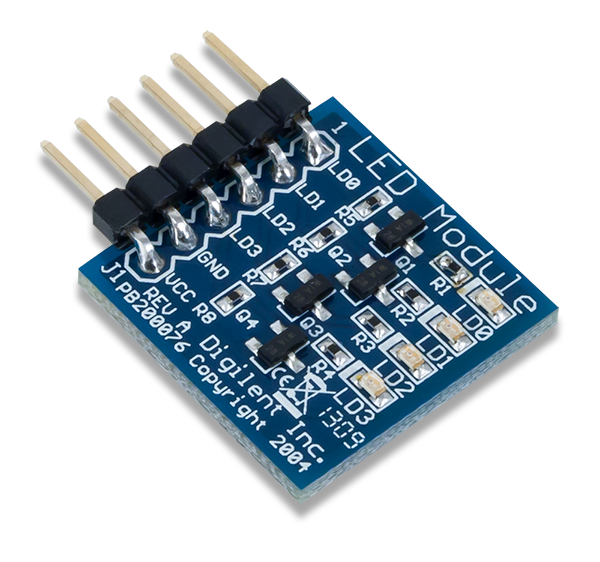
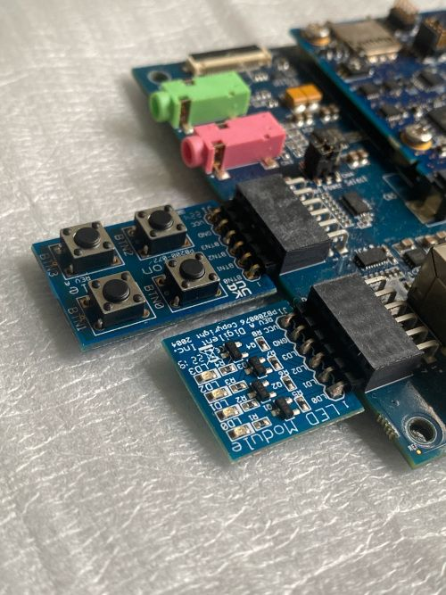
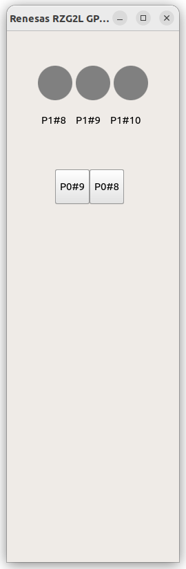
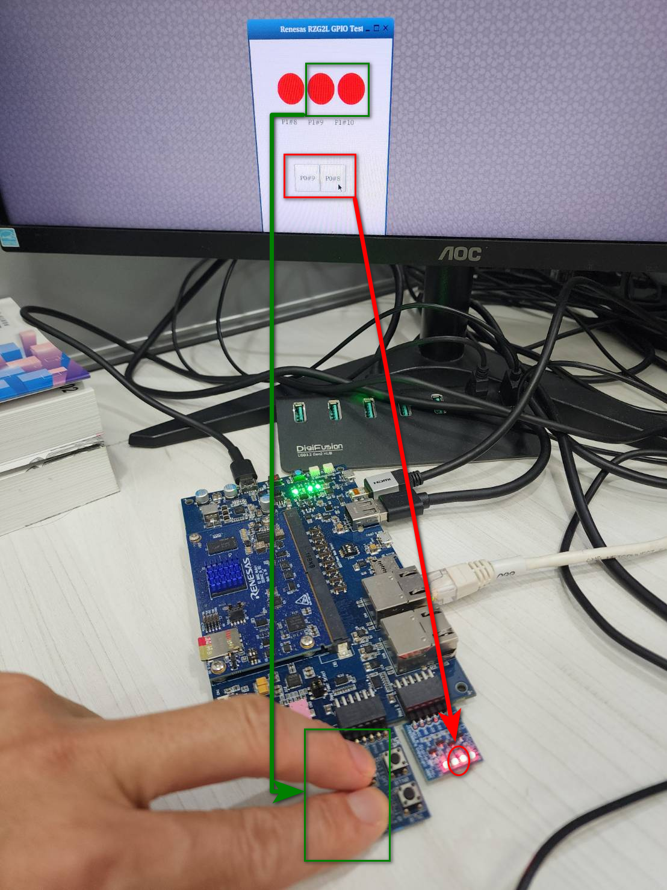

# Hardware Testing
### **PMOD Interface**

**Pmod** interface (**Peripheral module** interface) is an open standard defined by Digilent in the Pmod Interface Specification for connecting peripheral modules to FPGA and microcontroller development boards using 6 pins. Pmod or Pmods may also refer to modules compatible with the Pmod interface.

Pmods come with a standard **6-pin** interface of **4 signals**, one ground and one power pin

PIN#5 = GND

PIN#6 = Vcc

Pmods can use either SPI, I2C or UART protocol.

[Pmod Interface](https://en.wikipedia.org/wiki/Pmod_Interface)

We will test GPIO pins using PMOD button and PMOD Led small board.

### **PMOD Button**

https://digilent.com/reference/pmod/pmodbtn/start



### **PMOD Led**

https://digilent.com/reference/pmod/pmodled/start


Clone and build the below Github repository:

https://github.com/yourskc/q563_rzgpio/

For the matching to the configurations in our software program, plug the PMOD board to Renesas RZ/G2L. Connect the Led board to the lower pins of PMOD0 on Renesas carrier board, and connect the button board to the lower pins of PMOD1.



Transfer the executable **q563_rzgpio** to Renesas RZ/G2L, then run it,

```
./q563_rzgpio

```



This is a two-way test, click the button on the screen will see the on/off of Led, click on the PMOD buttons will see the color change of the red light on screen.

[Qt563 Renesas GPIO](https://www.youtube.com/watch?v=5rZZOqaB67k)

