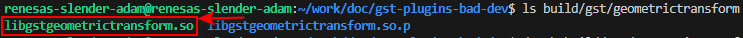
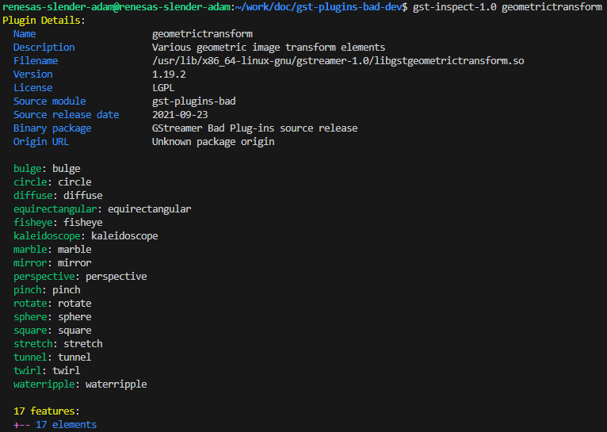
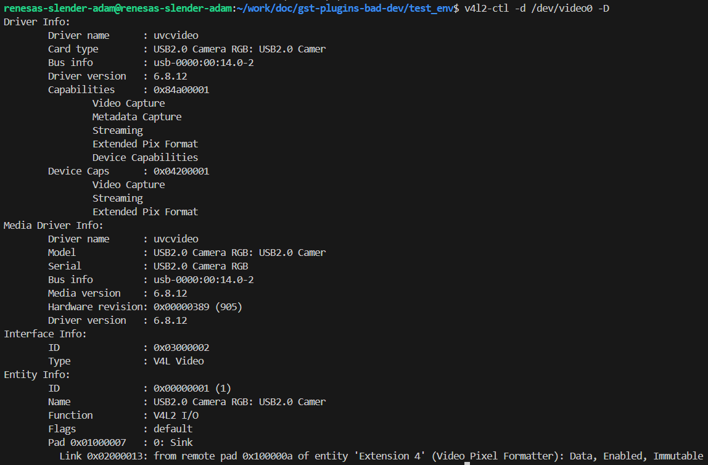

# Install Gstreamer
# （Ubuntu）N200 PC

```bash
sudo apt update
sudo apt install git
```

### **Install OpenCV**

```bash
sudo apt install libopencv-dev python3-opencv gstreamer1.0-opencv
```

### Git clone moildev_install

https://github.com/yourskc/moildev_install/tree/main

```bash
git clone https://github.com/yourskc/moildev_install.git
cd moildev_install

# Check your OpenCV version
dpkg -l | grep libopencv

# for x86_64 with OpenCV 4.x.x
cd opencv4
sudo ./install.sh
```

### **Installing GStreamer**

[Installing GStreamer](https://gstreamer.freedesktop.org/documentation/installing/index.html?gi-language=c)

To completely install GStreamer on **Ubuntu 22.04**, use the commands below:

```bash
sudo apt install libgstreamer1.0-dev libgstreamer-plugins-base1.0-dev libgstreamer-plugins-bad1.0-dev gstreamer1.0-plugins-base gstreamer1.0-plugins-good gstreamer1.0-plugins-bad gstreamer1.0-plugins-ugly gstreamer1.0-libav gstreamer1.0-tools gstreamer1.0-x gstreamer1.0-alsa gstreamer1.0-gl gstreamer1.0-gtk3 gstreamer1.0-qt5 gstreamer1.0-pulseaudio
```

**Command Line Tools:**

**gst-inspect-1.0**

[gst-inspect-1.0](https://gstreamer.freedesktop.org/documentation/tools/gst-inspect.html?gi-language=c#)

The below commands will **show the information** including the source module, plugin and element,

```bash
gst-inspect-1.0 opencv 

gst-inspect-1.0 geometrictransform

gst-inspect-1.0 circle
```

**gst-launch-1.0** 

[gst-launch-1.0](https://gstreamer.freedesktop.org/documentation/tools/gst-launch.html?gi-language=c)

```bash
gst-launch-1.0 videotestsrc ! autovideosink 

gst-launch-1.0 videotestsrc **pattern=0** ! autovideosink
```

**pattern = 0 ~ 25**

```bash
gst-launch-1.0 videotestsrc ! video/x-raw, width=1920, height=1080 ! autovideosink 

gst-launch-1.0 videotestsrc ! video/x-raw, width=1920, height=1080 ! videoconvert ! circle ! videoconvert ! autovideosink 
```


# **Project Download**

This is the referenced **original** project on Github:

https://github.com/GStreamer/gst-plugins-bad

### Git clone gst-plugins-bad-dev (modified)

https://github.com/yourskc/gst-plugins-bad-dev

This project includes a new element named **`equirectangular` as part of the `gst-plugins-bad` geometric transform plugin**. It contains GStreamer code units, build instructions, and test commands.

```bash
git clone https://github.com/yourskc/gst-plugins-bad-dev.git
```

### **Install Meson**

Install the Meson build system:

https://mesonbuild.com/Quick-guide.html

```bash
sudo apt-get install python3 python3-pip python3-setuptools python3-wheel ninja-build 

sudo apt install meson
or
pip3 install --user meson  # pip 安裝的版本較佳
```

### Build

```bash
cd gst-plugins-bad-dev

meson build
ninja -C build
```


★Check the created **`.so` files** in  **build/gst/geometrictransform/libgstgeometrictransform.so**



Copy **`.so` files** to the library folder

```bash
sudo cp ./build/gst/geometrictransform/**libgstgeometrictransform.so** /usr/lib/x86_64-linux-gnu/gstreamer-1.0
```

### Or copy the existing built **`.so` files (Optional)**

**download** and use the built one: 

[**libgstgeometrictransform.so**](http://140.112.12.82/docu-moil-renesas/assets/files/libgstgeometrictransform-10f897e764ba4e6b4ea645ec621ee6e1.so)

Then copy the **`.so` files** to your system folder,

```bash
sudo cp libgstgeometrictransform.so /usr/lib/x86_64-linux-gnu/gstreamer-1.0
```

### Check with `gst-inspect-1.0`:

```bash
gst-inspect-1.0 geometrictransform
```


```bash
gst-inspect-1.0 equirectangular
```

**Test USB Camera**

```bash
#【v4l2-ctl Camera Control】
# Installation :
sudo apt-get install v4l-utils

# list all camera devices
v4l2-ctl --list-devices
```


```bash
# display driver information
v4l2-ctl -d /dev/video0 -D
```



```bash
# get camera supported image format
v4l2-ctl -d /dev/video0 --list-formats
```


Reference :

```bash
v4l2-ctl -d /dev/video0 --list-formats-ext
```


### Test command

```bash
gst-launch-1.0 playbin uri=file:///home/renesas-slender-adam/work/doc/gst-plugins-bad-dev/test_env/endo01.mp4 video-sink='videoconvert ! equirectangular ! videoconvert ! autovideosink'

gst-launch-1.0 v4l2src device=/dev/video0 ! videoscale ! video/x-raw, width=1920, height=1080 ! videoconvert ! equirectangular ! videoconvert ! autovideosink
```