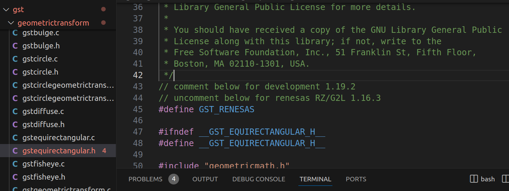
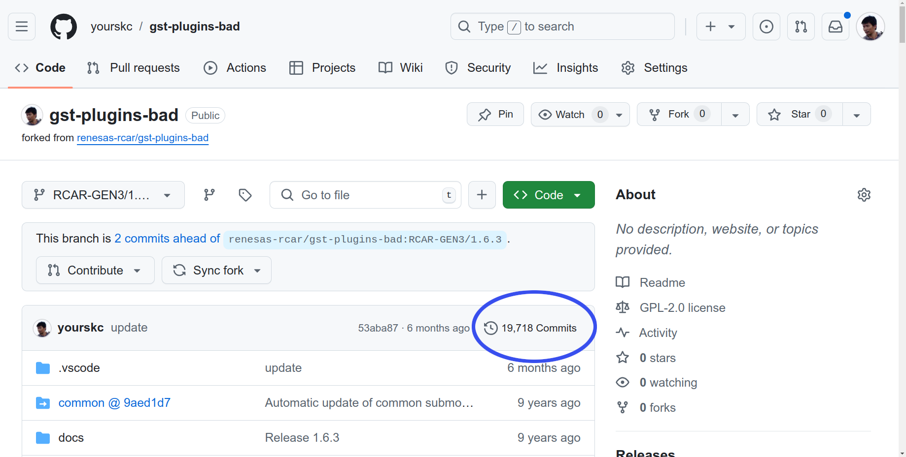

# Yocto Compilation
### Git clone gst-plugins-bad

```bash
git clone https://github.com/yourskc/gst-plugins-bad.git
cd gst-plugins-bad
git checkout RCAR-GEN3e/1.16.3
git branch
```

Perform the steps,

- Copy **`gstequirectangular.c`** and **`gstequirectangular.h`** under gst/geometrictransform/

in the development project 'gst-plugins-bad-dev' into the corresponding directory in 'gst-plugins-bad' project.

- Uncomment the `#define GST_RENESAS` definition line in the source program.



• Commit, push and remember the commit ID

```bash
git commit -m "comment"
git push
```

Get the commit ID in for folder:

```bash
cat .git/refs/heads/RCAR-GEN3e/1.16.3
```

or, on the below Github page,

https://github.com/yourskc/gst-plugins-bad/tree/RCAR-GEN3/1.6.3

In the upper-right corner of the file list, click on the `nnn Commits`, there is



Since the project in section 2-3 is build with `Meson build`. However, this project is build with `GNU Automake`

The build commands are as below,

```bash
./autogen.sh
make
```

This project is depend on some other packages. If you would like to try to build the project, we would suggest you try the compile process in Ubuntu 20.04.

However, since we already verify the corressness of the programs in the previous 2-3 section. We also can skip the build process in this stage.

tip: Compare to the original official gst-plugins-bad project, our project added equirectangular.c and .h files, and also midified some related sources. If you wish to add more new functions, You should also modify those files accordingly.