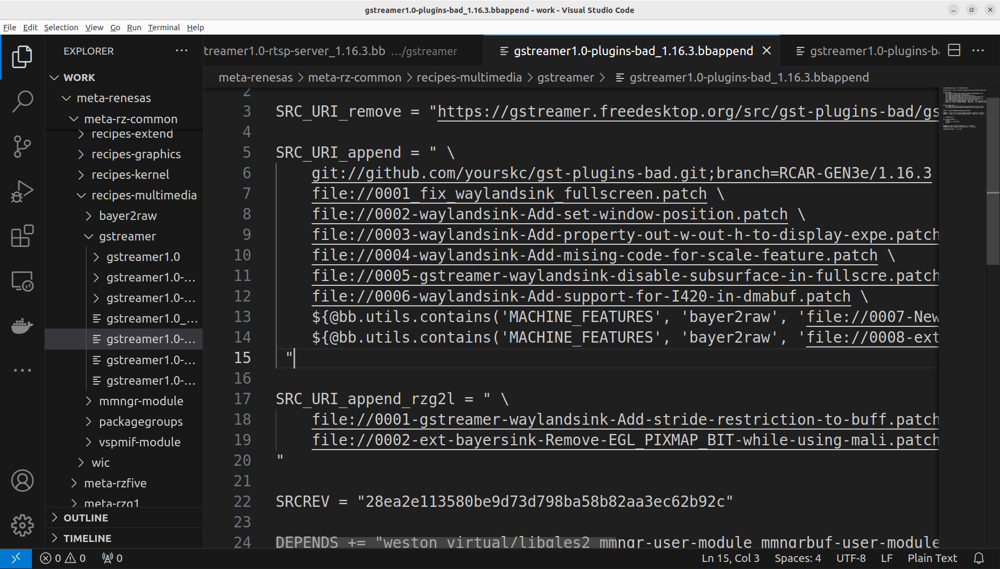
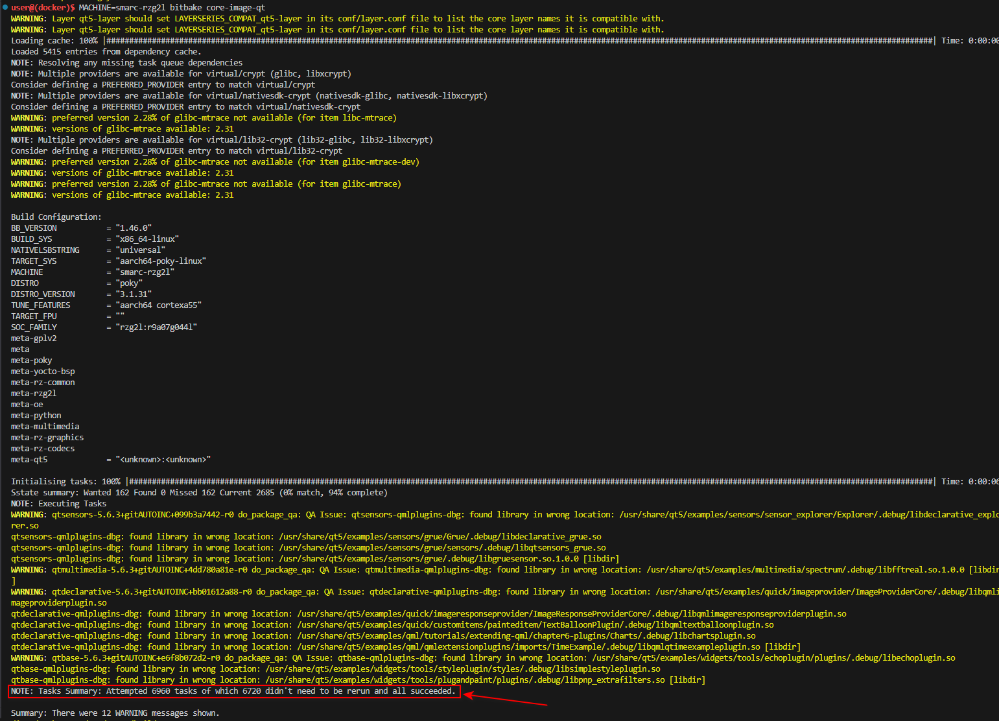

# Edit Recipes & Yocto Recompile
# （Ubuntu）N200 PC

Please ensure you already have a Docker container for Yocto project compilation.

Edit the `.bbappend` file in **Yocto** folder:

```
meta-renesas/meta-rz-common/recipes-multimedia/gstreamer/gstreamer1.0-plugins-bad_1.16.3.bbappend
```

Add the GitHub repository:

```
SRC_URI_append = " \
**git://github.com/yourskc/gst-plugins-bad.git;branch=RCAR-GEN3e/1.16.3 \**
```

Check commit ID:

```bash
git log # 查看詳細的提交歷史和 commit ID
git log --oneline  # 顯示簡短的 commit ID
**git rev-parse HEAD  # 顯示當前分支的最新 commit ID**
```

Insert the commit ID:

```
SRCREV="**28ea2e113580be9d73d798ba58b82aa3ec62b92c**"
```



Re-compile the Yocto image and write it to an SD card:

```bash
**# dir: /workspaces/rzg/yocto/build**
**MACHINE=smarc-rzg2l bitbake core-image-qt**
```



```bash
**# Write image to SD card
cd build/tmp/deploy/images/smarc-rzg2l/
# The output files of the build are** core-image-qt-smarc-rzg2l.wic.gz **&** core-image-qt-smarc-rzg2l.wic.bmap

**# Exit the Docker container, insert SD card to the PC
sudo fdisk -l       # check device ID of SD card** 
```


```bash
**# unmount partitions: suppose SD card mounted on /dev/sda1 & /dev/sda2
umount /dev/sda1
umount /dev/sda2

sudo apt install bmap-tools
# uses the bmaptool to copy a disk image file to the device /dev/sda
sudo bmaptool copy core-image-qt-smarc-rzg2l.wic.gz /dev/sda**
```


# （RZ/G2L）

Boot the RZ/G2L board and verify if the library exist with:

```bash
gst-inspect-1.0 equirectangular
```

The output would be as below, it reveal the exist of equirectangular element in the Gstreamer library


Prepare working directories,

```bash
cd /home/root
mkdir gst-work
cd gst-work
```

transfer test data from PC:

```bash
scp -r user@IP:/path/to/test_env/* .

for example:
scp -r skc@192.168.0.105:/home/skc/gst-work/gst-plugins-bad-dev/test_env/* .
```

Ensure `EquimatX` and `EquimatY` are in the directory before running of gst-launch-1.0 command with equirectangular filter.

**The filesize calculation of X,Y Maps**
Suppose the resolution is 1920 x 1080, each points use 4 bytes, with additional 16 bytes header, the filesize will be 8,294,416 bytes

Caculation : 1,920 x 1,080 x 4 + 16 = 8,294,416