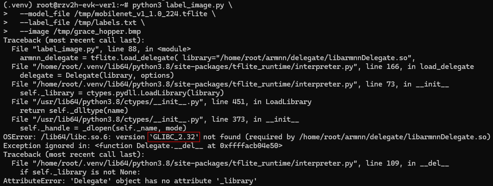

# Install V2H Image file into SD Card

# （Windows）

**Install Etcher：**

[balenaEtcher - Flash OS images to SD cards & USB drives](https://etcher.balena.io/#download-etcher)


**Choose Image file ：**


**Insert Card Reader with empty SD Card：** 


Insert SD card onthe board of RZ/V2H and boot up.

# Settings of OpenCV

# （V2H）

Connect to V2H by SSH

```bash
ssh root@192.168.113.164
```

Create virtual env of Python and install dependencies

```bash
python3 -m venv .venv    # .venv: invisible
ls -al  # check invisible folder
source .venv/bin/activate
pip install tflite-runtime pillow
```

[tensorflow/tensorflow/lite/examples/python at master · tensorflow/tensorflow](https://github.com/tensorflow/tensorflow/tree/master/tensorflow/lite/examples/python/)

### **Download sample model and image**

You can use any compatible model, but the following **MobileNet v1** model offers a good demonstration of a model trained to r**ecognize 1,000 different objects**.

```bash
# Get photo
curl https://raw.githubusercontent.com/tensorflow/tensorflow/master/tensorflow/lite/examples/label_image/testdata/grace_hopper.bmp > /tmp/grace_hopper.bmp
# Get model
curl https://storage.googleapis.com/download.tensorflow.org/models/mobilenet_v1_2018_02_22/mobilenet_v1_1.0_224.tgz | tar xzv -C /tmp
# Get labels
curl https://storage.googleapis.com/download.tensorflow.org/models/mobilenet_v1_1.0_224_frozen.tgz  | tar xzv -C /tmp  mobilenet_v1_1.0_224/labels.txt

mv /tmp/mobilenet_v1_1.0_224/labels.txt /tmp/
```

### **Run the sample**


```bash
curl https://raw.githubusercontent.com/tensorflow/tensorflow/refs/heads/master/tensorflow/lite/examples/python/label_image.py > label_image.py 

#★edit content
vi label_image.py   
# Insert the line
import tflite_runtime.interpreter as tflite
# Modify the word**
interpreter = tflite.Interpreter(model_path=args.model_file)
```

```bash
python3 label_image.py \
  --model_file /tmp/mobilenet_v1_1.0_224.tflite \
  --label_file /tmp/labels.txt \
  --image /tmp/grace_hopper.bmp
```

You should see results like this:

```bash
0.728693: military uniform
0.116163: Windsor tie
0.035517: bow tie
0.014874: mortarboard
0.011758: bolo tie
```

# （Windows）

Option (1) Download: https://github.com/ARM-software/armnn/releases/download/v24.11/MULTI_ISA-GCC11-ArmNN+ACL-linux-armv8.2-a.tar.gz

Option (2) Download ArmNN (**v24.05**): https://github.com/ARM-software/armnn/releases/tag/v24.05


```bash
scp MULTI_ISA-GCC11-ArmNN+ACL-linux-armv8.2-a.tar.gz root@192.168.113.164:/home/root
```

# （V2H）

```bash
# dir: /home/root
mkdir armnn
mv MULTI_ISA-GCC11-ArmNN+ACL-linux-armv8.2-a.tar.gz armnn
cd armnn/
tar -xzvf MULTI_ISA-GCC11-ArmNN+ACL-linux-armv8.2-a.tar.gz

env
export LD_LIBRARY_PATH=/home/root/armnn  # set env
ldconfig  # update config
```

https://github.com/ARM-software/armnn/blob/branches/armnn_25_02/delegate/DelegateQuickStartGuide.md

```bash
cd ..
#★edit content
vi label_image.py  
# Insert codes as the above link of github repo
armnn_delegate = tflite.load_delegate( library="<path-to-armnn-binaries>/libarmnnDelegate.so",
                                       options={"backends": "CpuAcc,GpuAcc,CpuRef", "logging-severity":"info"})
# Modify the word                                 
interpreter = tflite.Interpreter(
    model_path=args.model_file,
    experimental_delegates=[armnn_delegate],
    num_threads=args.num_threads)                        
```

```bash
python3 label_image.py \
  --model_file /tmp/mobilenet_v1_1.0_224.tflite \
  --label_file /tmp/labels.txt \
  --image /tmp/grace_hopper.bmp
```




