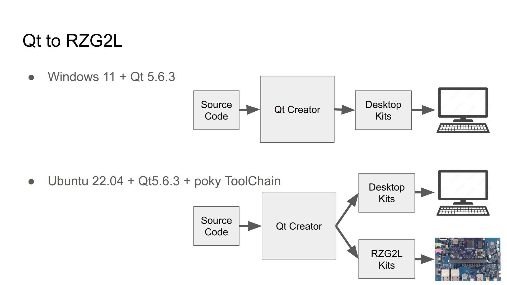

# Intro
Based on **PC/ Ubuntu 22.04** and **Windows 11** platform, we use Qt Creator as our development tools to **build Aarch64 applications**, then **transfer** them to **Renesas RZ/G2L** target board for execution.

Will take much time on the **modification of programs** and then **rebuild them**. For the efficiency consideration, we would **build our application on PC** instead of target platform.

The architecture is as below

In the chapters, will setup the Qt development environment both on Ubuntu 22.04 and Windows 11.

For **Windows 11**, it would be simpler, we just use it **for UI development**, please **download and install Qt 5.6.3**. That's already enough for development purpose.

For **Ubuntu 22.04**, we'll **install additional kits tools for building** for our target board Renesas RZ/G2L. That can be used to **make the final software for our product**.

**Environment:**

- Ubuntu 22.04
- Docker
- build Docker Container - Ubuntu 20.04
- Yocto build environment
- Download the Renesas RZ/G2L BSP

Build a Docker container for Yocto project compilation. Make sure you can successfully build Linux image file and then write it to SD card and boot on the target board Renesas RZ/G2L. 

[www.renesas.cn](https://www.renesas.cn/cn/zh/document/gde/smarc-evk-rzg2l-rzg2lc-rzg2ul-linux-start-guide-rev103?r=1467981)

Build Yocto project by using the options:

`MACHINE=smarc-rzg2l bitbake core-image-qt`