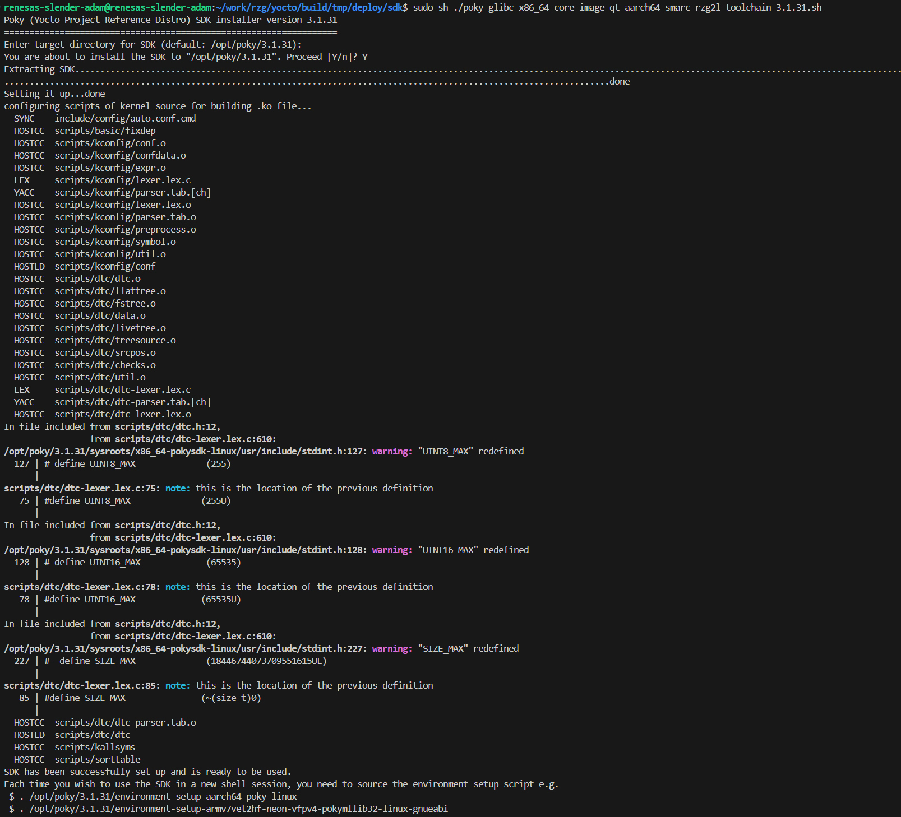

# Prepare ToolChain
# （Docker Ubutu 20.04）

Need to **compile the Yocto project to make the toolchain**, the toolchain will be installed on system, We'll **use them to set** the compilers, linkers and debugger… in the settings **of Qt Creator** later

### Build the yocto project

with parameters **`-c polulate_sdk`**

In the docker container of Ubutu 20.04, build the yocto project with appended parameters **`-c polulate_sdk`**

```bash
MACHINE=smarc-rzg2l bitbake core-image-qt **-c populate_sdk**
```

After building Yocto project, the **output script** (located as below) can be used to installed on your system.

**<work_dir>/build/tmp/deploy/sdk/poky-glibc-x86_64-core-image-qt-aarch64-smarc-rzg2l-toolchain-3.1.31.sh**

**Option 1:**

Right click on the file, then click on the checkbox `Permission/ Allow executing file as program`

Now you can **run the script to install the toolchain** on your Ubuntu 22.04.

**Option 2:**

```bash
# change the authority to **Permission/ Allow** **executing** file
chmod a+x <work_dir>/build/tmp/deploy/sdk/poky-glibc-x86_64-core-image-qt-aarch64-smarc-rzg2l-toolchain-3.1.31.sh

# run the script to install the toolchain on your Ubuntu 22.04.
sudo sh <work_dir>/build/tmp/deploy/sdk/poky-glibc-x86_64-core-image-qt-aarch64-smarc-rzg2l-toolchain-3.1.31.sh
```



All the tools under this folder **`/opt/poky/3.1.31`** will be used in the **kits settings** of Qt Creator.