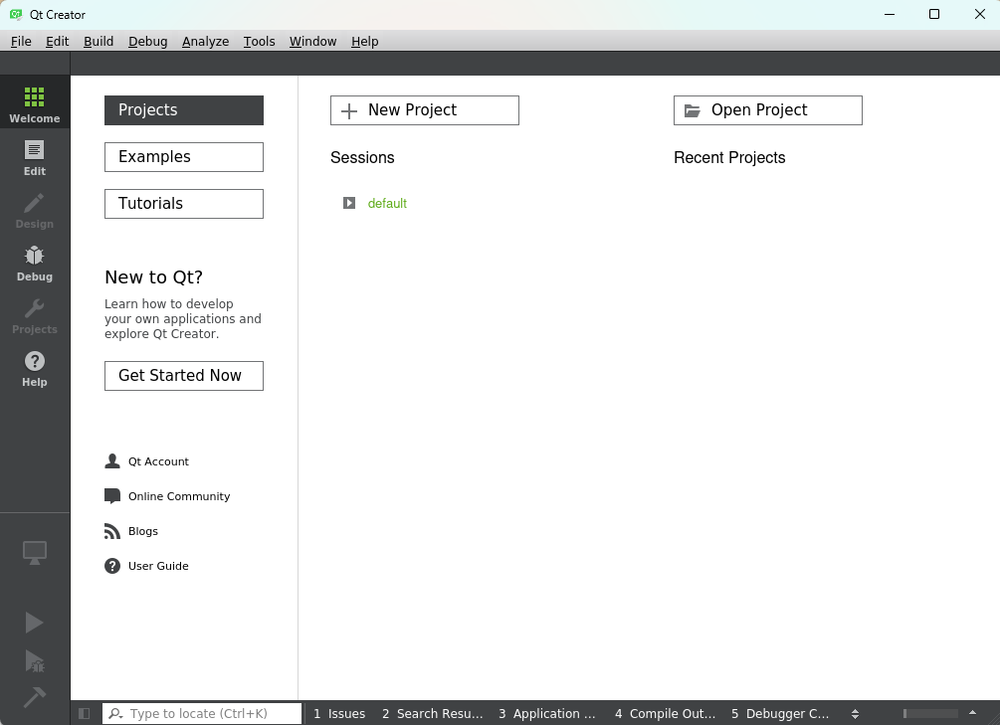
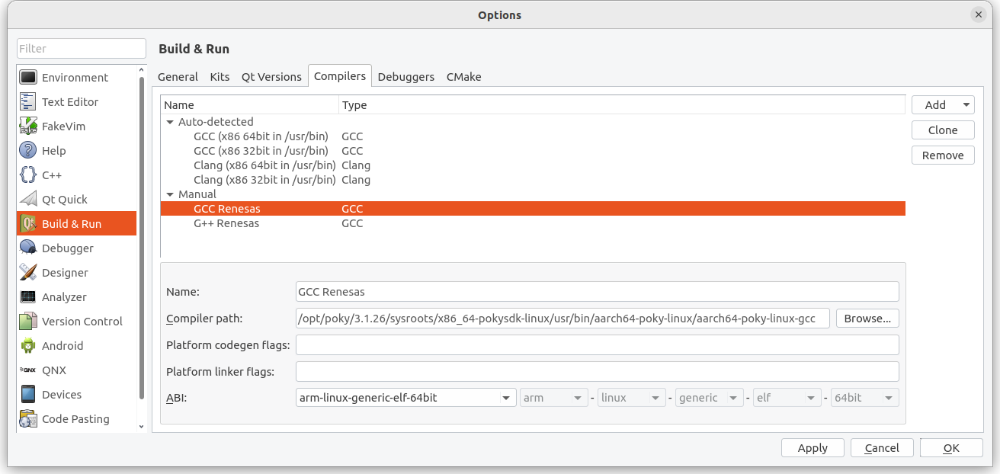

# Install Qt Creator
# （Ubuntu）N200 PC

### **Qt Creator Installation**

Install **Qt5.6.3** in **Ubuntu 22.04**, we'll use it as our mainly used version.

**Qt5.12.10** has some good examples, also can be used as references in **Windows (optional)**.

Download and install Qt from the below:

[Index of /new_archive/qt/5.6/5.6.3](https://download.qt.io/new_archive/qt/5.6/5.6.3/)


[Index of /archive/qt/5.12/5.12.10](https://download.qt.io/archive/qt/5.12/5.12.10/)


### Install Qt

```bash
./qt-opensource-linux-x64-5.6.3.run
```

當從遠端機器執行 GUI 應用程式時，它會在本地顯示。


**※Qt Switch between versions**

If you run a Qt version different from the one of the previous time, it may lead to errors. This is because **all Qt versions used the same location to save settings**. To avoid such errors, you may **backup the settings for individual versions**.

The locations of Qt settings :

**`Linux: ~/.config/QtProject`**

**`Windows: %appdata%/QtProject`**

**★Each time,  we need to set the environment variables before running Qt Creator. (∵設環境變數，之後才能 build Renesas版本)**

```bash
unset LD_LIBRARY_PATH

source /opt/poky/3.1.31/environment-setup-aarch64-poky-linux
```

**`LD_LIBRARY_PATH`** 是一個環境變數，用來**指定系統查找共享庫（shared libraries）的路徑**。在執行一個程式時，操作系統會使用這個變數來確定在哪些目錄中查找 `.so`（共享庫）文件。這樣，可以讓程式在執行時找到需要的動態庫。

**`LD` = Loader**，代表負責動態加載庫的工具或機制。

**`unset LD_LIBRARY_PATH`** 系統會刪除這個變數，這意味著：

- 系統在查找共享庫時不再使用 `LD_LIBRARY_PATH` 來指定的路徑。
- 這通常會導致系統**使用默認的共享庫**查找路徑。

```bash
echo $CC  # 原本什麼都沒有。如果有，表示當下已經 **cross compiler 環境！**
```


**`$CC`** = **C Compiler**，也就是 **C 編譯器**。是環境變數之一，通常用來指定 C 語言編譯器。在 Unix 和 Linux 系統中，`$CC` 代表 C 編譯器的**名稱或路徑**，通常是像 `gcc`（GNU 編譯器集合）這樣的編譯器。如果 `$CC` 沒有設置，則 `echo $CC` 可能不會輸出任何內容。在一些構建系統（如 `Makefile`）中，`$CC` 用來告訴系統應該使用哪一個編譯器來編譯 C 程式碼。如果沒有顯式設置，通常會默認使用 `gcc`。**在此之前用 `gcc`→ 設定之後可用 `$CC` 編譯跨平台的執行檔。**

### Run Qtcreator ( Qt5.6.3 )

```bash
cd ~/Qt5.6.3/Tools/QtCreator/bin/
./qtcreator
```

### **Start a new project**




### **Tools > External > Configure**


On the left side, click on `Devices`, Input the IP of RZ/G2L, click `Test` to start connection test.


Compared with example:


### **Set Kits**

Click on `Build & Run` on the left side. Choose `Kits` > `Add`, Set `Name` as "**RZ/G2L**".

 Set `C/C++ Compiler, Debugger, Qt Version, CMake`. Click on the `Manage` on the right side. Add and set the paths. 

Or choose from the Tabs on the upper tabs(Qt Version/ Compiler/ Debuggers/CMake ). Set all of the settings as below:

**Qt Kits Settings**

```
      Device : Select the Device in the previous step,

     Sysroot : /opt/poky/3.1.31/sysroots/aarch64-poky-linux

  C Compiler : /opt/poky/3.1.31/sysroots/x86_64-pokysdk-linux/usr/bin/aarch64-poky-linux/aarch64-poky-linux-gcc

C++ Compiler : /opt/poky/3.1.31/sysroots/x86_64-pokysdk-linux/usr/bin/aarch64-poky-linux/aarch64-poky-linux-g++

    Debugger : /opt/poky/3.1.31/sysroots/x86_64-pokysdk-linux/usr/bin/aarch64-poky-linux/aarch64-poky-linux-gdb

  Qt Version : /opt/poky/3.1.31/sysroots/x86_64-pokysdk-linux/usr/bin/qt5/qmake

       cmake : /opt/poky/3.1.31/sysroots/x86_64-pokysdk-linux/usr/bin/cmake
```


Compared with example:





After the settings, please make sure there are **no exclamation on the `Kits` icon**, or you need to check if there are some errors need to be fixed.