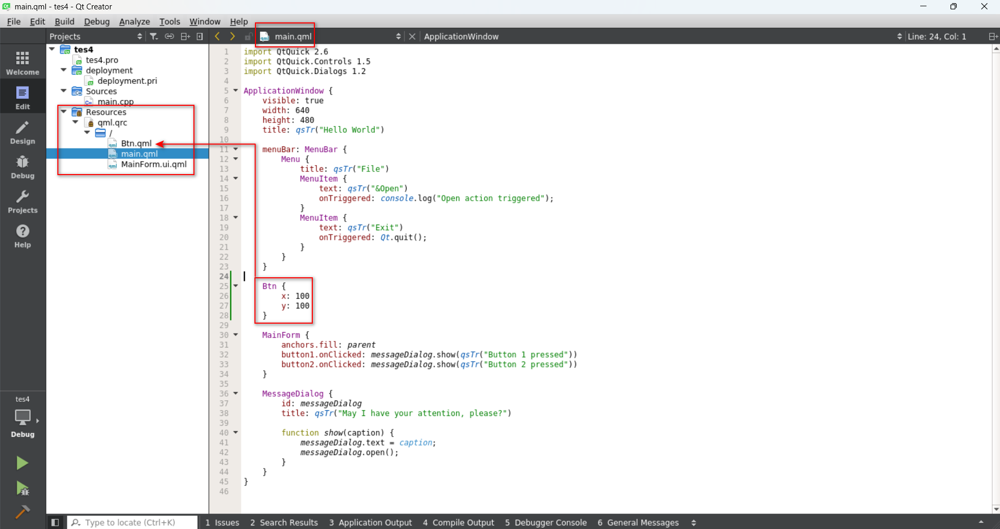

# Build Qt Project
**★Each time, input the commands as below before open Qt Creator.**

```bash
unset LD_LIBRARY_PATH

source /opt/poky/3.1.31/environment-setup-aarch64-poky-linux
```

### Run Qtcreator ( Qt5.6.3 )

```bash
cd ~/Qt5.6.3/Tools/QtCreator/bin/
./qtcreator
```

### Add Kit


### Select Kit before build


```bash
# Copy the files of build project to RZG2L（Yocto）
scp -r build-test3-RZG2L-Debug root@192.168.113.174:/home/root/work
```


Enter the folder and run Qt executable file to display the same window of Desktop version in Ubuntu.

**★Develop Qt in Desktop Kit and Execute Qt File in RZG2L.**

Note: **Qt Switch between versions**

If you run a Qt version different from the one of the previous time, it may lead to errors. This is because All Qt versions used the same location for saving settings. To avoid such errors, you may backup the settings for individual versions in different folder name. Recover by renaming the folder name to default name.

**The locations of Qt settings :**

**`Linux: ~/.config/QtProject`**

**`Windows: %appdata%/QtProject`**

★Click the item of “**Show Hidden Files**” in file-manager to show the folder of “**.config/QtProject**”.  

★ Create many parts in the file format of .qml, but write and edit in **main.qml** 




**Qt Examples** are located at the directory as below, projects are in the sub-directories by category.

**<Qt Dir>/Examples/Qt-5.6.3/**

The executable would be in another folder named as

/build-ex01-Desktop_Qt_5_6_3_GCC_64bit-Debug

you can also double click on the executable to run it outside of Qt Creator.

### QML (Qt Markup Language)

is a programming language based on JavaScript, used to design applications based on graphical user interfaces. QML is mainly used for mobile applications, focusing on touch input and user experience.

### Qt Quick

Different from Qt Widget, Qt Quick is a function library of QML Class and Functions that uses QML language to develop graphical interfaces.

### Qt Quick Controls

is an interface module in the Qt framework, which provides a set of visual user control components. It includes buttons, text input boxes, sliders, etc.

### **Qt Coffee Machine**

The official **Qt Coffee Machine** Example:

[Coffee Machine Example | Qt 5.15](https://doc.qt.io/qt-5/qtdoc-demos-coffee-example.html)

Modified version:

```bash
git clone https://github.com/yourskc/moil_coffee.git
```

### **Reference:**

[Qt563 New QtQuick Project](https://www.youtube.com/watch?v=LNVMQhFXNHA)

[What is QML?](https://www.youtube.com/watch?v=4U7j-B1mq00)

[Qt563 QML](https://www.youtube.com/watch?v=w_-jhwnOFvY)

[Qt 5.12.10 Example - Coffee](https://www.youtube.com/watch?v=it3XaNYqQ_c)

[Renesas RZ/G2L with touch screen, Coffee machine UI and GPIO test](https://www.youtube.com/watch?v=KOlx9MPbCOY)

[Qt Quick Controls 5.15.18](https://doc.qt.io/qt-5/qtquickcontrols-index.html)

[Qt Quick Designer | Qt Creator Documentation](https://doc.qt.io/qtcreator/creator-qtquickdesigner-plugin.html)