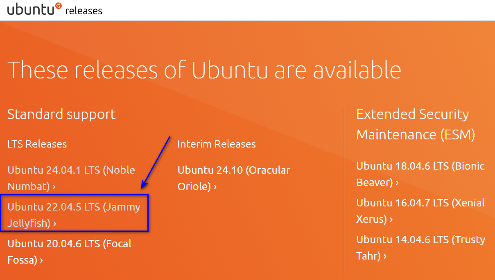
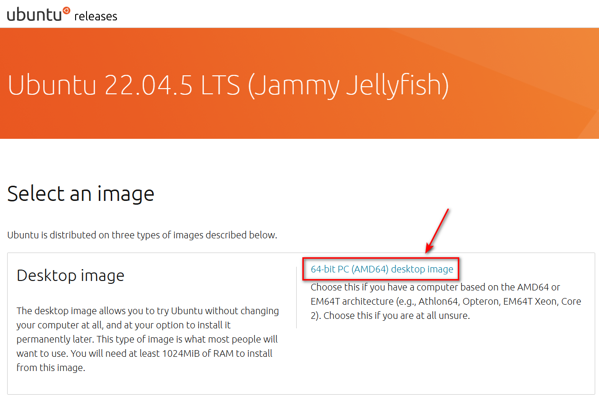
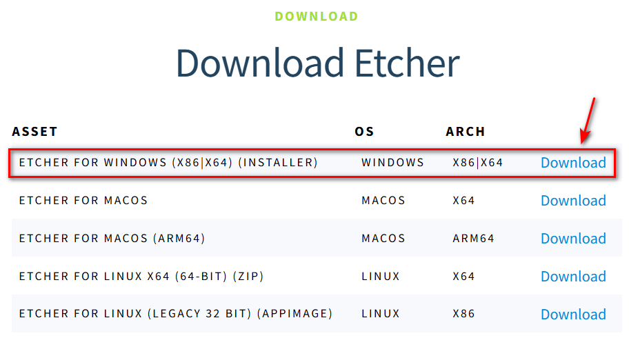
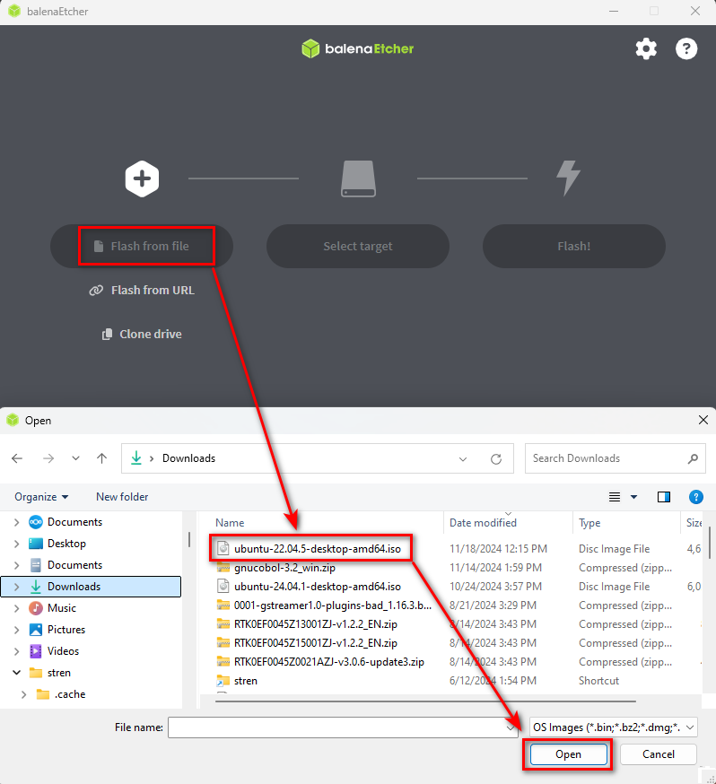
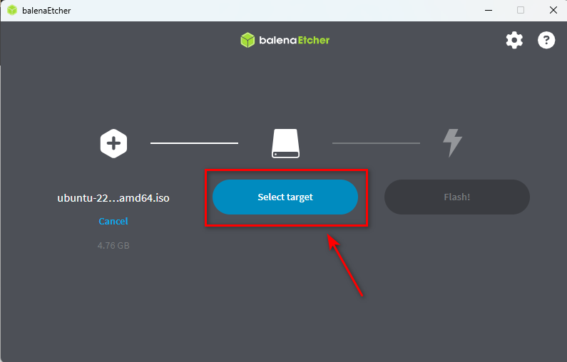
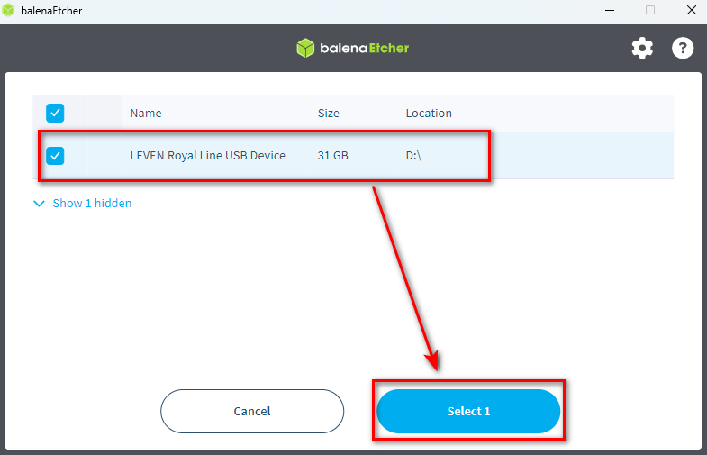
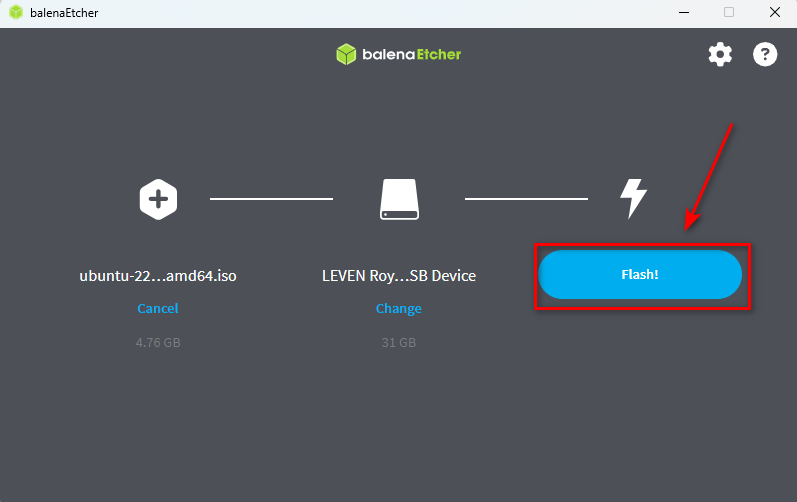
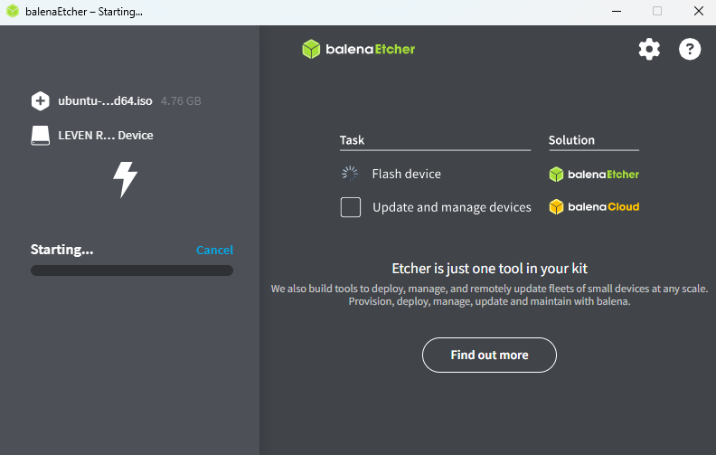
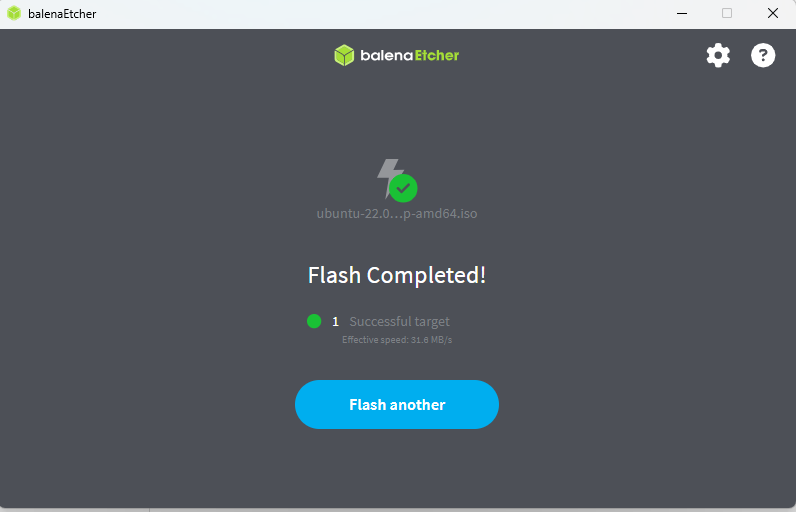

# Create a Bootable USB stick of Ubuntu
# （Windows）

## **Download an Ubuntu Image**

[Ubuntu Releases](https://mirror.twds.com.tw/ubuntu-releases/)

# **Create a Bootable USB stick**
### Insert a USB stick to PC

[balenaEtcher - Flash OS images to SD cards & USB drives](https://etcher.balena.io/#download-etcher)

