# Install Ubuntu in N200 PC
Insert the bootable USB stick into N200 PC before turning on. Then start N200 PC in BIOS mode (**F2** or **F9** or **F10** or **delete** button).

Follow steps as below:

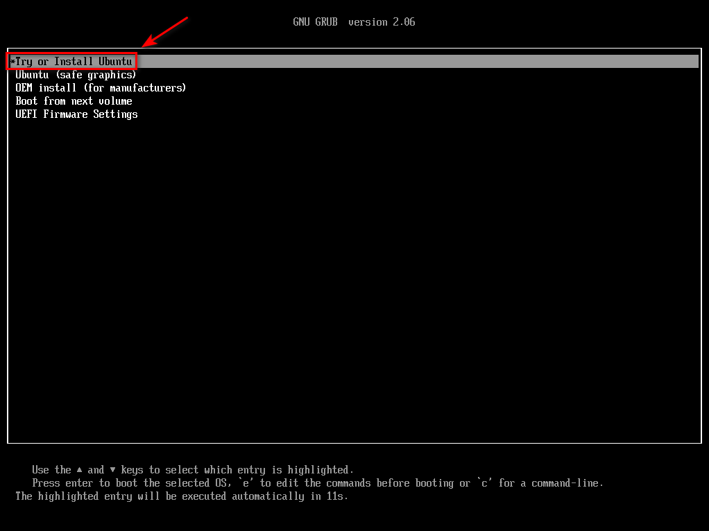
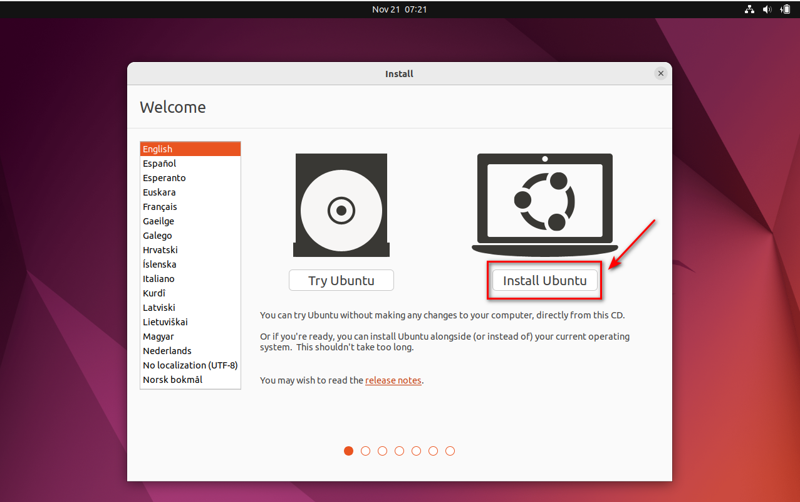
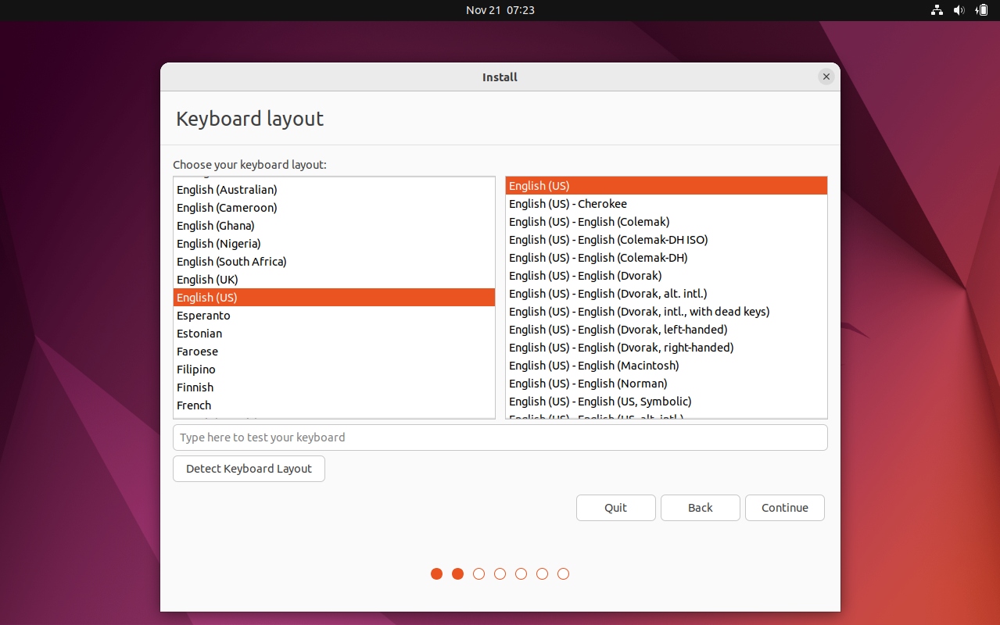
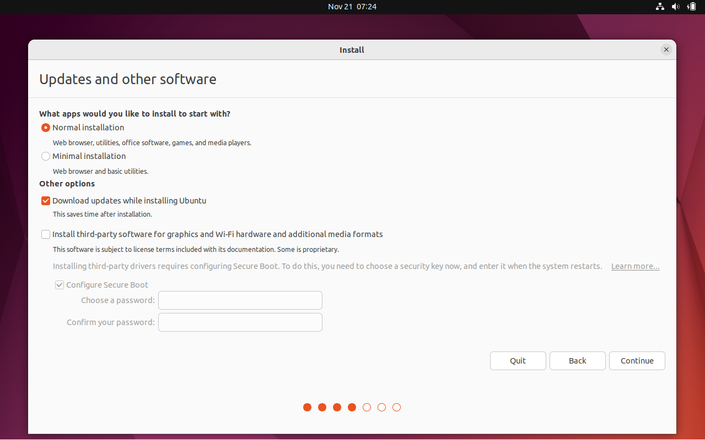
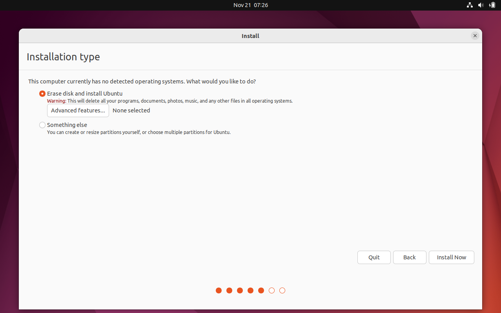
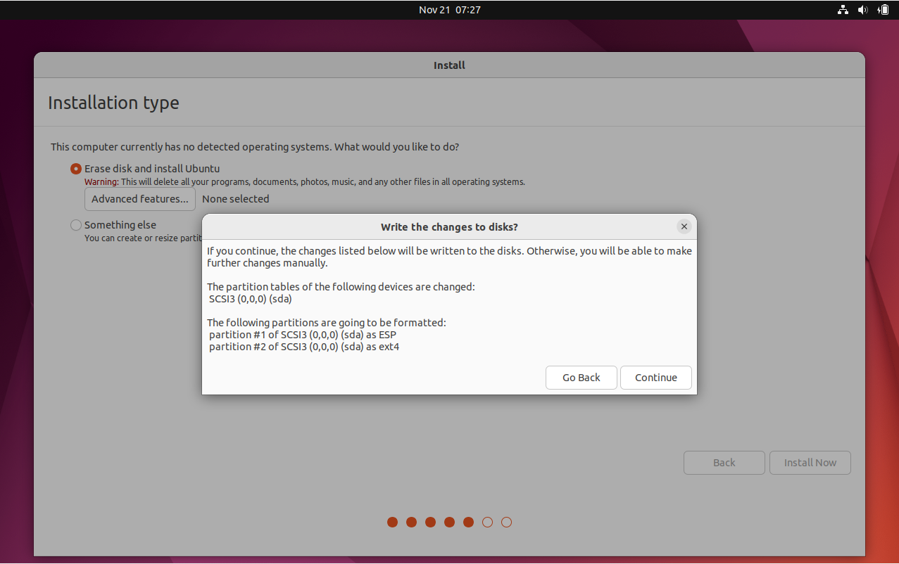
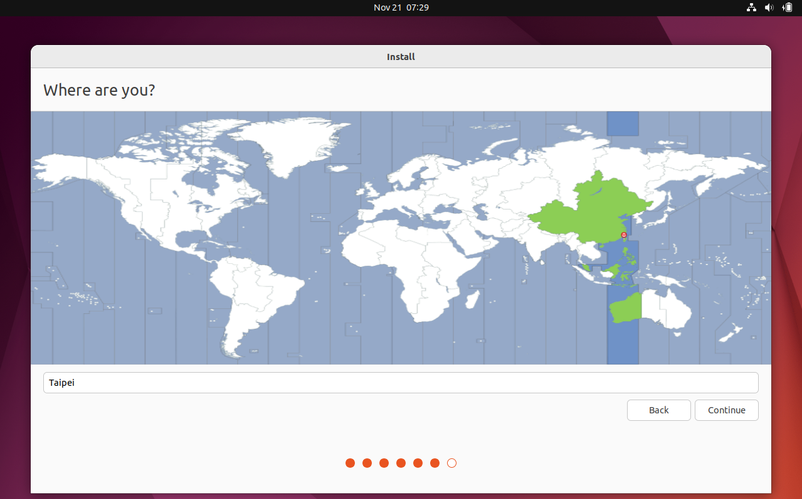
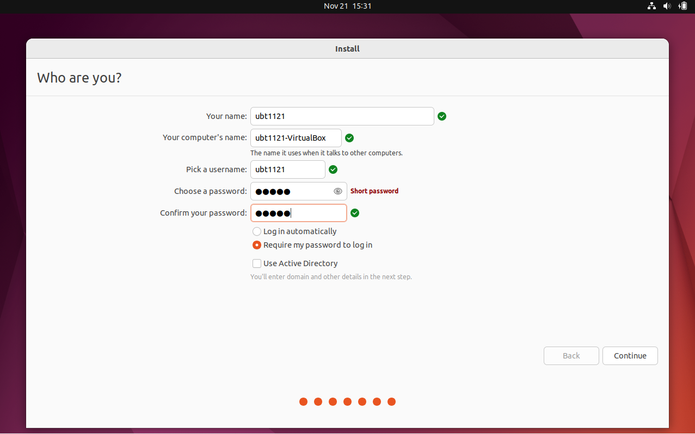
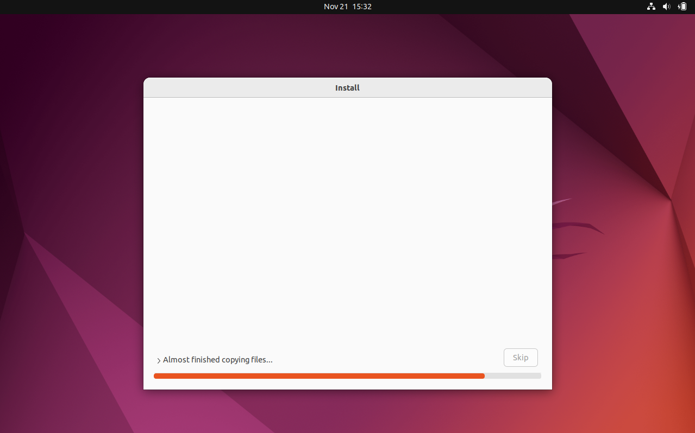

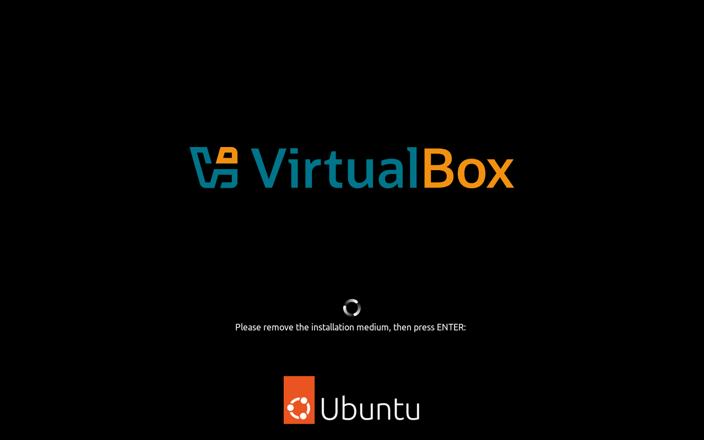
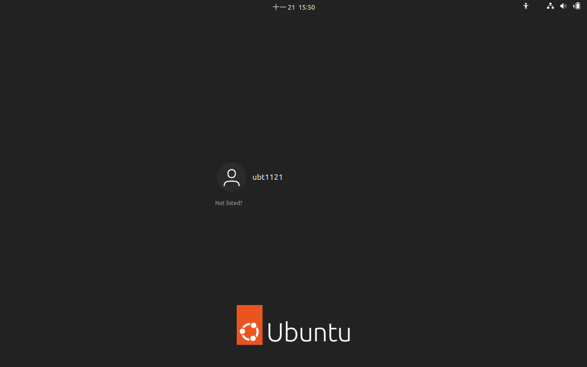
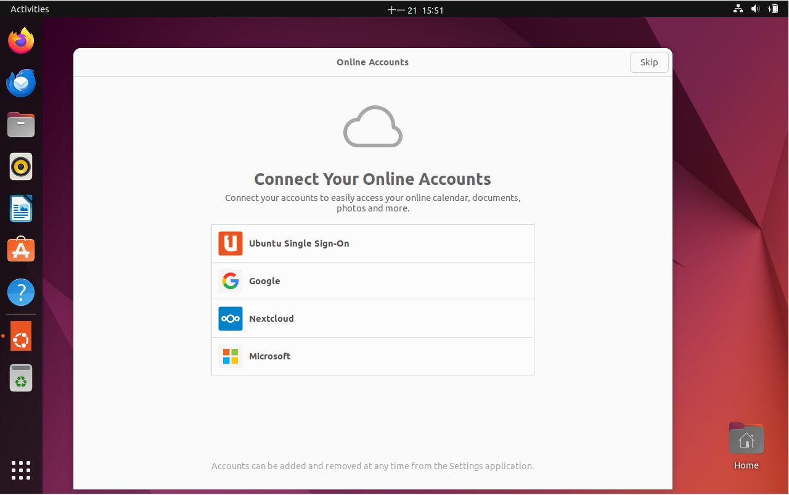
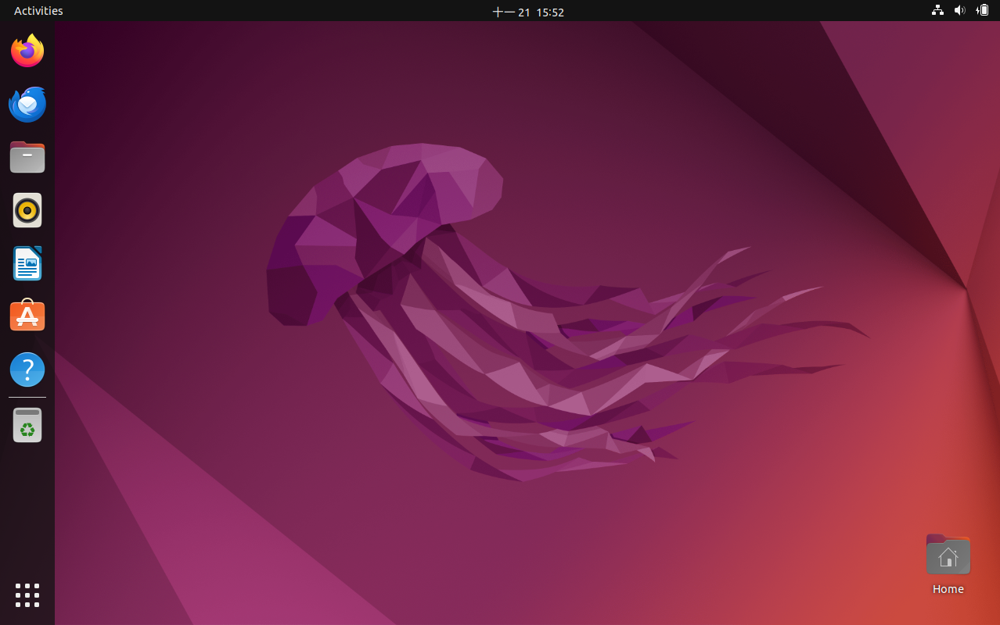
