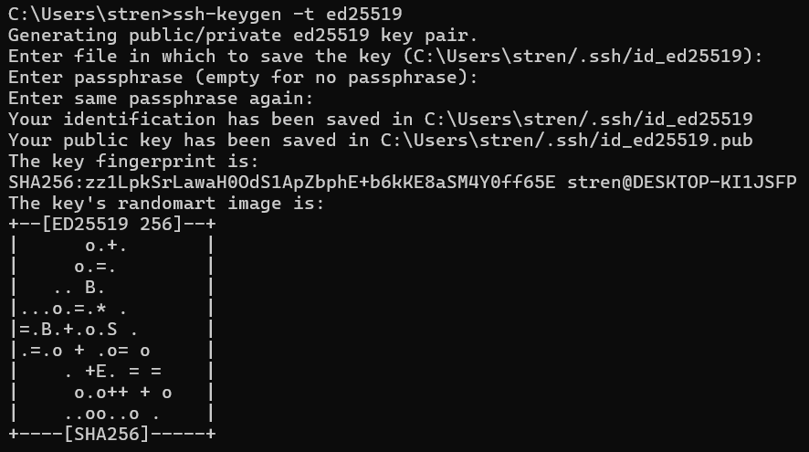
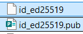
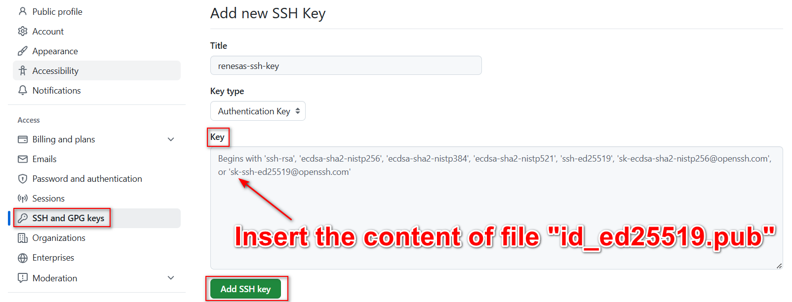
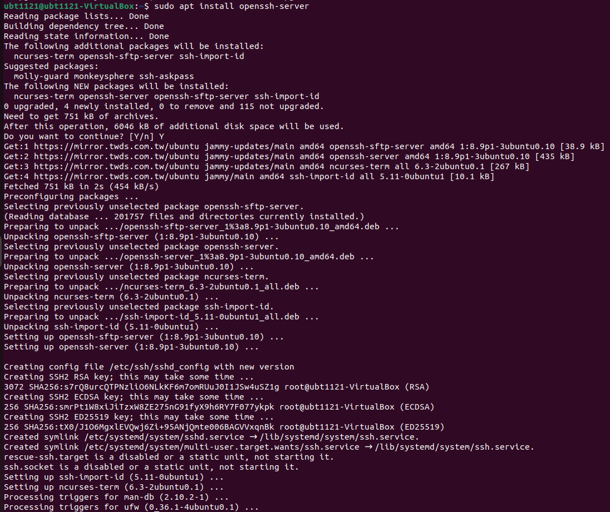

# Install OpenSSH Server
# （Windows）

**Generate ssh key pair:**

```bash
ssh-keygen -t ed25519 -C "renesas-ssh-key"
```

**-t** is the abbreviation of **type**, which is used to specify the encryption algorithm type of the SSH key pair, such as rsa, dsa, ecdsa, ed25519, etc.

Two files will be generated in the ".ssh" directory under the **user's home directory: **id_ed25519**: **Private key file**  **for secure login**, should be kept properly and should not be shared with anyone. **id_ed25519.pub**: **Public key authentication**, which is publicly available and can be added to the remote server's ~/.ssh/authorized_keys file to enable password-free login.

**-C** is used to provide a **comment** for the key pair. This comment is typically used to help identify the purpose or owner of this key pair.



**There are 2 files in the folder of “.ssh”：**



### Log into GitHub > Settings > SSH and GPG keys > New SSH key:



# （Ubuntu）N200 PC

**Install OpenSSH Server**

```bash
sudo apt install openssh-server
```



```bash
sudo cp /etc/ssh/sshd_config /etc/ssh/sshd_config.original  # 備份原本
sudo chmod a-w /etc/ssh/sshd_config.original  # 對所有使用者取消該文件寫入權限
```

**Configure the SSH server**

```bash
sudo nano /etc/ssh/sshd_config
```

**Check for and adjust existing occurrences of these configuration directives, or add new ones, as required:**

- **`Ctrl + W`**：Search keyword
- **`Ctrl + X`**：Exit to save

```bash
# PermitRootLogin prohibit-password → PermitRootLogin no
默認設置（如果這行被註釋掉或設置為 PermitRootLogin yes）：允許 root 用戶通過 SSH 使用密碼登錄。
其他設置：
PermitRootLogin yes：允許 root 用戶通過 SSH 使用密碼登錄，這樣不太安全，通常不推薦這樣配置。
PermitRootLogin no：完全禁止 root ****用戶通過 SSH 登錄，這樣會強迫系統管理員使用其他用戶（比如 sudo）來獲取 root 權限。
PermitRootLogin prohibit-password**：允許 root 用戶通過 SSH 登錄，但禁止使用密碼登錄，只能使用 SSH 密鑰進行身份驗證。

# PasswordAuthentication yes → no  # 關閉「密碼」驗證
```

**Check the configuration after changing it before restarting the server:**

```bash
sudo sshd -t -f /etc/ssh/sshd_config
```

-t 參數是 test 的縮寫，用於檢查配置文件的語法。
-f 參數是 file 的縮寫，用於指定配置文件的路徑。
一個用來檢查 SSH 配置文件語法正確性的命令，不會影響正在運行的 SSH 服務。確保修改後的配置文件不會導致 SSH 服務故障或無法登錄的有效手段。

**Restart the ssh service to pick up configuration changes:**

```bash
sudo systemctl try-reload-or-restart ssh
```

這個命令是用來重新加載或重啟 SSH 服務（通常是指 sshd 服務）的命令。

**import ssh key from github:**

```bash
ssh-import-id-gh <github-username>
```

繞道從GitHub取公鑰導入（也方便以後使用GitHub）
import之後公鑰存入 **~/.ssh/authorized_keys** → 可以 **cat 瀏覽** or **nano 編輯**它

### Check the server ip address using **`ip a`**

# （Windows）

*Connect to the server using ssh:*

```bash
ssh <username>@<server-ip>
```