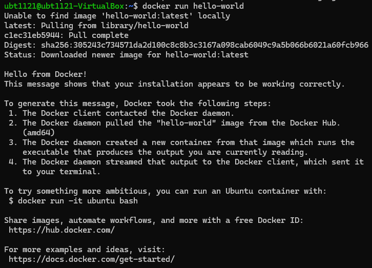

# Install Docker Engine
# （Ubuntu）N200 PC

Add Docker's official GPG key:

```bash
sudo apt update
sudo apt install ca-certificates curl
sudo install -m 0755 -d /etc/apt/keyrings
```

**install**：通常用於複製文件並設置文件權限。這裡它是用來創建目錄。install 命令可以創建目錄並同時設置特定的權限。

**-m 0755**：-m 是 "**mode**" 的縮寫。設置目錄權限的選項。0755 是一個八進制值，表示權限設置：
	7 代表所有者有讀、寫、執行權限（rwx）。
	第二個 7 代表同組的用戶有讀、寫、執行權限（rwx）。
	5 代表其他用戶只有讀取和執行權限（rx），沒有寫入權限。
	所以，0755 設置了所有者和組用戶可以完全操作該目錄，而其他用戶只能讀取和執行，不能修改。

**-d**：這個選項告訴 install 命令創建目錄，而不是複製文件。也就是說，命令會確保創建一個目錄（如果該目錄尚不存在的話）。

**/etc/apt/keyrings**：這是要創建的目錄路徑，具體是在 /etc/apt 目錄下。/etc/apt 是與 APT（高級包工具）相關的配置文件目錄，APT 是用來管理 Linux 系統中軟件包的工具。

```bash
sudo curl -fsSL https://download.docker.com/linux/ubuntu/gpg -o /etc/apt/keyrings/docker.asc
```

**curl**：用來從網絡上下載或傳送資料。它可以支持多種協議（例如 HTTP、HTTPS、FTP 等），並且可以與其他命令結合使用。

**-fsSL**： 這些是 curl 的選項，代表：

	-f：如果下載的資源無法成功獲取（例如，網頁 404 或 500 錯誤），curl 將會停止並返回錯誤。
	-s：讓 curl 在執行時不顯示任何進度或錯誤訊息（即以靜默模式運行）。
	-S：與 -s 共同使用，允許顯示錯誤訊息，這樣即使使用了靜默模式，也能在出錯時顯示錯誤信息。
	-L：如果 curl 請求的資源被重定向，這個選項會告訴 curl 跟隨重定向並繼續下載。

https://download.docker.com/linux/ubuntu/gpg 這是curl 要下載的文件的 URL。這個 URL 指向 Docker 官方網站上提供的 GPG 密鑰，該密鑰用於驗證 Docker 軟件包的來源和完整性。

-o：這個選項告訴 curl 將下載的文件保存到指定的路徑。這裡的 -o 之後是保存文件的路徑。

**/etc/apt/keyrings/docker.asc**：這是保存下載的 GPG 密鑰的路徑。docker.asc 是下載的 GPG 密鑰文件名，並且保存在 /etc/apt/keyrings 目錄下。這個目錄通常用來存儲 APT 包管理系統的密鑰。

```bash
sudo chmod a+r /etc/apt/keyrings/docker.asc
```

chmod：用來更改文件或目錄權限的命令。它允許用戶設置文件或目錄的讀、寫、執行等權限。

a+r：這是 chmod 命令中的權限設置選項，代表：

	a 代表 "all"（所有用戶），即包括文件的所有者、同組用戶和其他用戶。
	+r 表示為指定的文件或目錄添加讀取權限（read permission）。這意味著所有用戶將能夠讀取該文件，但不一定能修改或執行它。

Add the repository to Apt sources:

```bash
echo \
  "deb [arch=$(dpkg --print-architecture) signed-by=/etc/apt/keyrings/docker.asc] https://download.docker.com/linux/ubuntu \
  $(. /etc/os-release && echo "$VERSION_CODENAME") stable" | \
  sudo tee /etc/apt/sources.list.d/docker.list > /dev/null
```

將 Docker 的官方 APT 存儲庫源添加到 Ubuntu 系統的 APT 配置中，以便能夠通過 `apt` 安裝和更新 Docker。

### Install the Docker packages

```bash
sudo apt update

sudo apt install docker-ce docker-ce-cli containerd.io docker-buildx-plugin docker-compose-plugin
```

## Post-Installation steps for Docker Engine[](https://m11158002.github.io/moil-renesas/docs/note/general/docker#post-installation-steps-for-docker-engine)

1. Create the docker group
    
    ```bash
    sudo groupadd docker
    ```
    
2. Add your user to the docker group
    
    ```bash
    sudo usermod -aG docker $USER
    ```
    
    usermod：修改系統用戶的命令。它允許修改用戶帳戶的多個屬性，例如組、主目錄、用戶名稱等。

    -aG：

    	-a：這個選項是 "append" 的縮寫，表示將用戶添加到指定的組中，而不會從其他組中移除該用戶。沒有這個選項，usermod 命令會將用戶從其他所有組中移除，只留下新指定的組。
    	-G：這個選項後面跟的是要添加的組名。這裡的 docker 表示將用戶添加到 docker 組中。

    $USER：是一個環境變量，代表當前登錄的用戶名稱。當執行這條命令時，$USER 會被替換成當前用戶的名字，從而將當前用戶添加到 docker 組中。
    → 將當前用戶添加到 docker 組中，這樣該用戶就可以在不使用 sudo 的情況下運行 Docker 命令。通常，只有屬於 docker 組的用戶才可以無需 sudo 執行 Docker 命令，這樣可以避免每次運行 Docker 命令時都要加上 sudo。在執行這條命令後，該用戶**需要重新登錄（退出並重新登錄）才能使組變更生效**，或者可以**使用 newgrp docker** 命令**立即使變更生效**，這樣就可以開始使用 Docker 命令而無需 sudo。
    
    ```bash
    id -nG | grep docker
    ```
    
    檢查當前使用者是否屬於 `docker` 組。
    - `id` 命令用來顯示當前使用者的相關信息。
    - `-n` 是`**--name**` 的縮寫參數指示 `id` 顯示組名（而非數字形式的組 ID）。
    - `-G` 參數顯示當前使用者所屬的所有組。
    - 所以，`id -nG` 會列出當前使用者所屬的所有組名。
    - `grep` 命令用來搜索輸入內容中是否包含某個特定的字串。
    - `grep docker` 會過濾並檢查是否存在 `docker` 組。
      - 如果當前使用者屬於 `docker` 組，則命令會輸出 `docker`。
      - 如果當前使用者**不屬於 `docker` 組**，則**不會有任何輸出**。
    
3. activate the changes to groups:
    
    ```bash
    newgrp docker
    ```
    
4. Verify that you can run docker commands without sudo
    
    ```bash
    docker run hello-world
    ```
