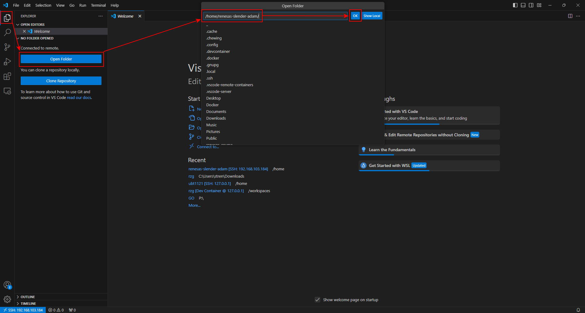

# Install VSCode & Build Yocto
# （Windows）
[Download VSCode](https://code.visualstudio.com/download)

### Download software and install in PC


# （Ubuntu）N200 PC

### Check IP address
```bash
ip a
```

### Ubuntu version
```bash
lsb_release -a
```


★Due to the difference of Ubuntu version between **N200 (Ubuntu 22.04 for later Gstreamer)** and developing requirement, need to create **Ubuntu 20.04** in Docker’s container for **building Yocto**.

# （Windows）

### VSCode of Windows controls “docker engine” of Ubuntu remotely





```bash
mkdir work
cd work
wget http://192.168.113.104/rz/orig/rzg/rzg.tar.gz
tar zxvf rzg.tar.gz

# Without this setting, an error occurs when **building procedure runs git command to apply patches
git config --global --list
git config --global user.email "you@example.com"
git config --global user.name "Your Name"
```


# （VSCode_Docker_Ubuntu）

```bash
# install additional packages in the Dcoker container
sudo apt-get update

sudo apt-get install gawk wget git-core diffstat unzip texinfo gcc-multilib \
build-essential chrpath socat cpio python python3 python3-pip python3-pexpect \
xz-utils debianutils iputils-ping libsdl1.2-dev xterm p7zip-full libyaml-dev \
libssl-dev bmap-tools

# install some additional packages, such as Cmake and Meson
sudo apt update
sudo apt install software-properties-common
# "apt-add-repository" command is part of "software-properties-common" package 
sudo apt-add-repository 'deb https://apt.kitware.com/ubuntu/ bionic main'
sudo apt update
sudo apt install cmake

sudo apt install meson ninja-build
```


```bash
# The links below are temporary in Jimmy's computer
wget [http://192.168.113.104/rz/RZG/Graphics%20Library/](http://192.168.113.104/rz/orig/rzg/)RTK0EF0045Z13001ZJ-v1.2.2_EN.zip
wget [http://192.168.113.104/rz/RZG/RZG%20Verified%20Linux%20Package/](http://192.168.113.104/rz/orig/rzg/)RTK0EF0045Z0021AZJ-v3.0.6-update3.zip
wget [http://192.168.113.104/rz/RZG/Video%20Codec%20Library/](http://192.168.113.104/rz/orig/rzg/)RTK0EF0045Z15001ZJ-v1.2.2_EN.zip

unzip RTK0EF0045Z13001ZJ-v1.2.2_EN.zip
unzip RTK0EF0045Z0021AZJ-v3.0.6-update3.zip
unzip RTK0EF0045Z15001ZJ-v1.2.2_EN.zip

mkdir yocto
cd yocto

tar zxvf ../RTK0EF0045Z13001ZJ-v1.2.2_EN/meta-rz-features_graphics_v1.2.2.tar.gz
tar zxvf ../RTK0EF0045Z0021AZJ-v3.0.6-update3/rzg_vlp_v3.0.6.tar.gz
tar zxvf ../RTK0EF0045Z15001ZJ-v1.2.2_EN/meta-rz-features_codec_v1.2.2.tar.gz
解壓文件：
	z：壓縮檔案是經過 gzip 壓縮的，因此需要解壓縮的檔案格式為 .gz 或 .tgz。
	x 表示解壓（extract）。
	v 表示顯示過程（verbose），可以看到解壓的文件列表。
	f 表示指定文件。

ls -1
```


```bash
# apply a patch file to update vlp(Verified Linux Package) to update3.
patch -p1 < ../RTK0EF0045Z0021AZJ-v3.0.6-update3/vlpg306-to-vlpg306update3.patch

cd meta-renesas
patch -p1 < ../extra/0001-rz-common-recipes-debian-buster-glibc-update-to-v2.2.patch
patch -p1 < ../extra/0001-rz-common-linux-update-linux-kernel-to-the-latest-re.patch
patch -p1 < ../extra/0001-rz-common-gst-plugins-bad-Depending-bayer2raw-if-lay.patch

cd ..
# dir: /workspaces/rzg/yocto
wget https://m11158002.github.io/moil-renesas/assets/files/0001-gstreamer-moil-plugin-91a25cd4d16fc479aefd2aa853466770.patch
wget https://m11158002.github.io/moil-renesas/assets/files/0002-fix_qtsmarthome_url-db1d20dcf1b5af60dc7034e78271ddc2.patch
# apply a patch file to add the GStreamer Moil Plugin
patch -p1 < 0001-gstreamer-moil-plugin-91a25cd4d16fc479aefd2aa853466770.patch
# apply a patch file to fix the Qt Smart Home URL
patch -p1 < 0002-fix_qtsmarthome_url-db1d20dcf1b5af60dc7034e78271ddc2.patch

# initialize a build using the oe-init-build-env script in Poky and set environment variable TEMPLATECONF to the below path.
#★ Each time entering the container, it's necessary to set the environment variables
TEMPLATECONF=$PWD/meta-renesas/meta-rzg2l/docs/template/conf/ source poky/oe-init-build-env build

# dir: /workspaces/rzg/yocto/build
# add necessary layers for AI application to build/conf/bblayers.conf (configration file for layers).
bitbake-layers add-layer ../meta-rz-features/meta-rz-graphics
bitbake-layers add-layer ../meta-rz-features/meta-rz-codecs
```


```bash
# dir: /workspaces/rzg/yocto/build
wget http://192.168.113.104/rz/orig/rzg/downloads.tar.gz
tar zxvf downloads.tar.gz
```

### Build qt5 image

```bash
# add the meta-qt5 layer for qt5.
bitbake-layers add-layer ../meta-qt5

# check "local.conf" file
nano conf/local.conf
# (ctrl + w) input QT_DEMO = "1" to search & comment out as below & (ctrl + x) to save
```


```bash
# dir: /workspaces/rzg/yocto/build
MACHINE=smarc-rzg2l bitbake core-image-qt

# build cross compiler installer (will use later)
MACHINE=smarc-rzg2l bitbake core-image-qt -c populate_sdk
```


# （Ubuntu）N200 PC

```bash
# Write image to SD card
cd build/tmp/deploy/images/smarc-rzg2l/
# The output files of the build are** core-image-qt-smarc-rzg2l.wic.gz & core-image-qt-smarc-rzg2l.wic.bmap

# Exit the Docker container, insert SD card to the PC
sudo fdisk -l       # check device ID of SD card
```


```bash
# unmount partitions: suppose SD card mounted on /dev/sda1 & /dev/sda2
umount /dev/sda1
umount /dev/sda2

sudo apt install bmap-tools
# uses the bmaptool to copy a disk image file to the device /dev/sda
sudo bmaptool copy core-image-weston-smarc-rzg2l.wic.gz /dev/sda
sudo bmaptool copy core-image-qt-smarc-rzg2l.wic.gz /dev/sda
```


**Remove SD card.** 

**Insert it to PCB of RZ/G2L, and boot up.** 

**Open a terminal > input some Linux commands for test.**